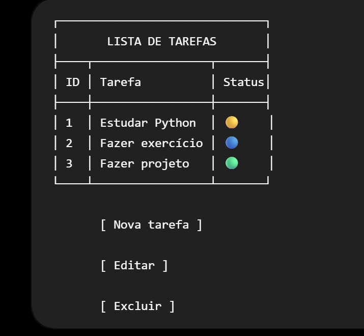

O projeto consiste na criação de uma Lista de Tarefas utilizando Streamlit e FastAPI.

O Streamlit será responsável pela interface do sistema, permitindo cadastrar, visualizar, editar e excluir tarefas.

O FastAPI será responsável pelo backend e pela criação da API que receberá e fornecerá os dados para o Streamlit.

As tarefas poderão ser armazenadas inicialmente em um arquivo JSON.

O objetivo é praticar a integração entre frontend, backend, API REST e Python.